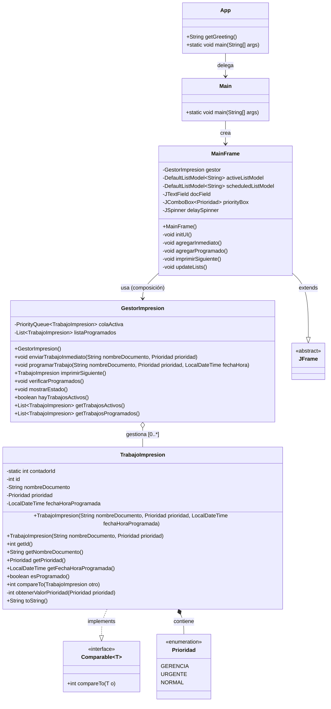
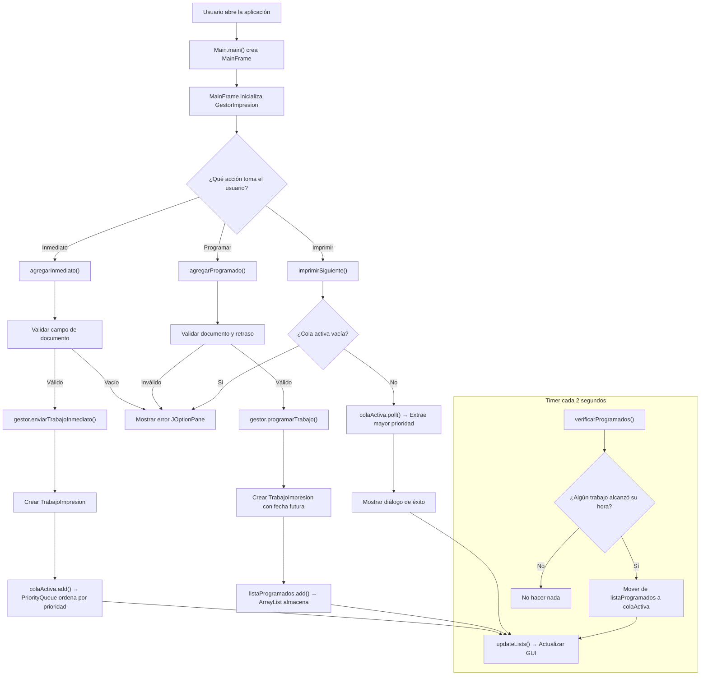

# Sistema de Gestión de Impresión — Documentación del Proyecto

**Materia:** Estructuras de Datos  
**Lenguaje:** Java 21  
**Framework GUI:** Java Swing  
**Build System:** Gradle 9.2  

---

## Tabla de Contenidos

1. [Descripción de la Solución](#1-descripción-de-la-solución)
2. [Diagrama de Clases](#2-diagrama-de-clases)
3. [Justificación de Estructuras de Datos](#3-justificación-de-estructuras-de-datos)
4. [Uso de Genéricos](#4-uso-de-genéricos)
5. [Principios de Programación Orientada a Objetos](#5-principios-de-programación-orientada-a-objetos)
6. [Manejo de Errores](#6-manejo-de-errores)
7. [Interfaz Gráfica](#7-interfaz-gráfica)
8. [Ejecuciones del Programa](#8-ejecuciones-del-programa)
9. [Estructura del Proyecto](#9-estructura-del-proyecto)

---

## 1. Descripción de la Solución

### Problema

Se requiere un sistema que simule la gestión de una cola de impresión en un entorno empresarial. Los documentos enviados a la impresora deben procesarse según su **prioridad** (Gerencia > Urgente > Normal), y además debe existir la capacidad de **programar** trabajos para que se impriman en un momento futuro.

### Solución Implementada

El **Sistema de Gestión de Impresión** es una aplicación Java que permite:

- **Enviar trabajos inmediatos:** El documento se agrega directamente a la cola activa y se procesa según su prioridad.
- **Programar trabajos:** El documento se almacena en una lista de espera hasta que llegue la hora programada, momento en el cual se mueve automáticamente a la cola activa.
- **Imprimir el siguiente trabajo:** Se extrae e imprime el trabajo con mayor prioridad de la cola activa.
- **Visualizar el estado:** Tanto por consola como mediante una interfaz gráfica (Swing), se puede ver el estado de ambas colas en tiempo real.

El sistema se compone de **5 clases** organizadas en el paquete `proyecto_estructuras`:

| Clase | Responsabilidad |
|---|---|
| `TrabajoImpresion` | Modelo de datos que representa un trabajo de impresión con ID, nombre, prioridad y fecha programada. |
| `GestorImpresion` | Lógica de negocio: gestiona las colas de impresión (activa y programada). |
| `MainFrame` | Interfaz gráfica de usuario construida con Java Swing. |
| `Main` | Punto de entrada de la aplicación; lanza la GUI. |
| `App` | Clase wrapper generada por Gradle que delega al `Main`. |

---

## 2. Diagrama de Clases



### Descripción de las Relaciones

| Relación | Tipo | Descripción |
|---|---|---|
| `TrabajoImpresion` → `Comparable<TrabajoImpresion>` | **Implementación** | Permite comparar trabajos por prioridad para el ordenamiento automático en la `PriorityQueue`. |
| `TrabajoImpresion` → `Prioridad` | **Composición** | El enum `Prioridad` es una clase interna de `TrabajoImpresion` con tres niveles: `GERENCIA`, `URGENTE`, `NORMAL`. |
| `MainFrame` → `JFrame` | **Herencia** | La ventana principal extiende `JFrame` para obtener funcionalidad de ventana Swing. |
| `GestorImpresion` → `TrabajoImpresion` | **Agregación** | El gestor almacena y administra múltiples instancias de `TrabajoImpresion`. |
| `MainFrame` → `GestorImpresion` | **Composición** | El frame contiene y posee una instancia del gestor de impresión. |
| `Main` → `MainFrame` | **Dependencia** | `Main` crea e inicializa el `MainFrame`. |
| `App` → `Main` | **Dependencia** | `App` delega la ejecución a `Main.main()`. |

---

## 3. Justificación de Estructuras de Datos

### 3.1 `PriorityQueue<TrabajoImpresion>` — Cola Activa

```java
private PriorityQueue<TrabajoImpresion> colaActiva;
```

**¿Por qué se eligió?**

La **cola de prioridad** (`PriorityQueue`) es la estructura ideal para la cola de impresión activa porque:

1. **Ordenamiento automático por prioridad:** Cada vez que se inserta un elemento, la cola lo posiciona según el resultado de `compareTo()`. Los trabajos de `GERENCIA` siempre se procesan antes que los `URGENTE`, y estos antes que los `NORMAL`.

2. **Complejidad eficiente:**
   - Inserción: **O(log n)** — se inserta y se reordena el heap.
   - Extracción del mínimo (mayor prioridad): **O(log n)** — se extrae la raíz y se rebalancea.
   - Consulta del próximo: **O(1)** — `peek()` retorna la raíz sin eliminar.

3. **Semántica FIFO con prioridad:** A diferencia de una cola simple (FIFO), la `PriorityQueue` respeta el orden de prioridad, que es el requisito del negocio: "los documentos de gerencia se imprimen primero".

4. **Alternativas consideradas y descartadas:**
   - **`LinkedList` como cola simple:** No soporta prioridad nativamente. Habría que buscar manualmente el elemento de mayor prioridad en cada extracción → **O(n)**.
   - **`TreeSet`:** Ordena automáticamente, pero no permite duplicados (dos documentos con la misma prioridad no podrían coexistir).
   - **Cola personalizada con arreglo ordenado:** Inserción costosa **O(n)** por el desplazamiento de elementos.

### 3.2 `ArrayList<TrabajoImpresion>` — Lista de Programados

```java
private List<TrabajoImpresion> listaProgramados;
```

**¿Por qué se eligió?**

La **lista** (`ArrayList`) es ideal para los trabajos programados porque:

1. **No requiere ordenamiento:** Los trabajos programados no necesitan estar ordenados por prioridad, ya que aún no están activos. Solo necesitamos iterar sobre ellos periódicamente para verificar si ha llegado su hora.

2. **Acceso aleatorio eficiente:** `ArrayList` proporciona acceso por índice en **O(1)** para la lectura y visualización del estado.

3. **Iteración lineal:** Para verificar las fechas programadas, necesitamos recorrer todos los elementos → **O(n)**, que es óptimo para cualquier estructura lineal.

4. **Flexibilidad:** Permite agregar y remover elementos sin restricciones de unicidad ni de orden.

5. **Alternativas consideradas y descartadas:**
   - **`LinkedList`:** Inserción/eliminación ligeramente más eficiente en el medio, pero acceso por índice es **O(n)**. No se justifica dado el volumen esperado de datos.
   - **`PriorityQueue`:** Innecesario para los programados, ya que el criterio de movimiento es temporal, no de prioridad.

### 3.3 Resumen Comparativo

| Aspecto | `PriorityQueue` (Cola Activa) | `ArrayList` (Programados) |
|---|---|---|
| **Propósito** | Procesar por prioridad | Almacenar hasta su hora |
| **Inserción** | O(log n) | O(1) amortizado |
| **Extracción** | O(log n) del mayor | O(n) búsqueda + remoción |
| **Criterio de orden** | Prioridad (GERENCIA > URGENTE > NORMAL) | No requiere orden |
| **Duplicados** | ✅ Sí permite | ✅ Sí permite |

---

## 4. Uso de Genéricos

El proyecto hace uso extensivo de **genéricos de Java** para garantizar seguridad de tipos en tiempo de compilación:

### 4.1 Interfaz `Comparable<TrabajoImpresion>`

```java
public class TrabajoImpresion implements Comparable<TrabajoImpresion> {
    @Override
    public int compareTo(TrabajoImpresion otro) {
        return Integer.compare(
            obtenerValorPrioridad(otro.prioridad),
            obtenerValorPrioridad(this.prioridad)
        );
    }
}
```

- El parámetro de tipo `<TrabajoImpresion>` en `Comparable<TrabajoImpresion>` especifica que esta clase solo se puede comparar con instancias de su mismo tipo.
- Esto evita comparaciones accidentales con otros objetos y elimina la necesidad de casting (`(TrabajoImpresion) o`).
- La `PriorityQueue` utiliza este `compareTo()` internamente para mantener el orden del heap.

### 4.2 Colecciones Parametrizadas

```java
// Cola de prioridad tipada — solo acepta TrabajoImpresion
private PriorityQueue<TrabajoImpresion> colaActiva;

// Lista tipada — solo acepta TrabajoImpresion
private List<TrabajoImpresion> listaProgramados;

// Retorno tipado — el compilador garantiza el tipo de los elementos
public List<TrabajoImpresion> getTrabajosActivos() { ... }
```

**Beneficios:**
- **Seguridad de tipos en compilación:** El compilador verifica que no se inserten tipos incorrectos.
- **Eliminación de castings:** No es necesario hacer `(TrabajoImpresion) cola.poll()`.
- **Código autodocumentado:** El tipo paramétrico indica claramente qué contiene cada colección.

### 4.3 Componentes Swing con Genéricos

```java
// Modelo de lista tipado para la GUI
private DefaultListModel<String> activeListModel;

// ComboBox tipado con el enum
private JComboBox<TrabajoImpresion.Prioridad> priorityBox;
```

Los componentes Swing también están parametrizados, asegurando que la GUI solo trabaje con los tipos correctos.

---

## 5. Principios de Programación Orientada a Objetos

### 5.1 Encapsulamiento

Todas las clases del proyecto aplican encapsulamiento riguroso:

```java
public class TrabajoImpresion {
    private static int contadorId = 1;     // Estado interno oculto
    private int id;                         // Solo lectura vía getter
    private String nombreDocumento;         // Solo lectura vía getter
    private Prioridad prioridad;            // Solo lectura vía getter
    private LocalDateTime fechaHoraProgramada; // Solo lectura vía getter

    // Solo getters, no setters → objeto inmutable después de la creación
    public int getId() { return id; }
    public String getNombreDocumento() { return nombreDocumento; }
    // ...
}
```

**Principios aplicados:**
- Todos los atributos son `private`.
- Se proveen **solo getters** (sin setters) → los objetos `TrabajoImpresion` son efectivamente **inmutables** después de su construcción.
- El `contadorId` es `private static`, asegurando que la generación de IDs es controlada internamente.
- `GestorImpresion` oculta sus colecciones internas y solo expone **copias** de las listas:

```java
public List<TrabajoImpresion> getTrabajosActivos() {
    List<TrabajoImpresion> temp = new ArrayList<>(colaActiva); // Copia defensiva
    temp.sort(TrabajoImpresion::compareTo);
    return temp;
}
```

### 5.2 Herencia

```java
public class MainFrame extends JFrame {
    // Hereda toda la funcionalidad de ventana de JFrame
    // (setTitle, setSize, setVisible, etc.)
}
```

`MainFrame` **extiende** `JFrame` para reutilizar toda la infraestructura de ventanas de Swing sin tener que reimplementarla.

### 5.3 Polimorfismo

```java
public class TrabajoImpresion implements Comparable<TrabajoImpresion> {
    @Override
    public int compareTo(TrabajoImpresion otro) {
        // Implementación polimórfica de la comparación
    }

    @Override
    public String toString() {
        // Representación personalizada del objeto
    }
}
```

- **Polimorfismo de interfaz:** `TrabajoImpresion` implementa `Comparable<T>`, lo que permite que la `PriorityQueue` lo ordene sin conocer los detalles internos de la comparación.
- **Polimorfismo de sobrescritura:** `toString()` es sobrescrito para proporcionar una representación legible del trabajo.
- **Enum con comportamiento:** `Prioridad` es un enum tipado con valores semánticos que se utilizan polimórficamente en el `switch` de `obtenerValorPrioridad()`.

---

## 6. Manejo de Errores

El proyecto implementa manejo de errores en múltiples niveles:

### 6.1 Validación en el Modelo (`TrabajoImpresion`)

```java
public TrabajoImpresion(String nombreDocumento, Prioridad prioridad, LocalDateTime fechaHoraProgramada) {
    Objects.requireNonNull(nombreDocumento, "El nombre del documento no puede ser nulo");
    Objects.requireNonNull(prioridad, "La prioridad no puede ser nula");
    if (nombreDocumento.trim().isEmpty()) {
        throw new IllegalArgumentException("El nombre del documento no puede estar vacío");
    }
    // ...
}
```

- `Objects.requireNonNull()` lanza `NullPointerException` con mensaje descriptivo si se pasa `null`.
- Validación de cadena vacía con `IllegalArgumentException`.
- Se usa `trim()` para evitar nombres con solo espacios.

### 6.2 Validación en la Lógica de Negocio (`GestorImpresion`)

```java
public TrabajoImpresion imprimirSiguiente() {
    if (colaActiva.isEmpty()) {
        System.out.println(" No hay trabajos en la cola activa.");
        return null;  // Retorno seguro en lugar de excepción
    }
    // ...
}
```

- Verificación de cola vacía antes de intentar extraer.
- Verificaciones de `null` en `fechaHoraProgramada` antes de comparar fechas.

### 6.3 Validación en la Interfaz Gráfica (`MainFrame`)

```java
private void agregarInmediato() {
    String doc = docField.getText().trim();
    if (doc.isEmpty()) {
        JOptionPane.showMessageDialog(this, 
            "Por favor ingrese un nombre de documento.", 
            "Error", JOptionPane.ERROR_MESSAGE);
        return;
    }
    // ...
}

private void agregarProgramado() {
    // ...
    int delay = (Integer) delaySpinner.getValue() * 3600;
    if (delay <= 0) {
        JOptionPane.showMessageDialog(this, 
            "El retraso debe ser mayor a 0 para programar.", 
            "Error", JOptionPane.ERROR_MESSAGE);
        return;
    }
    // ...
}
```

- Diálogos de error amigables (`JOptionPane`) para el usuario.
- Validación de campos vacíos y valores numéricos antes de procesar.

---

## 7. Interfaz Gráfica 

El proyecto incluye una **interfaz gráfica completa** implementada con **Java Swing** en la clase `MainFrame`:

### Componentes de la GUI

| Componente | Tipo Swing | Función |
|---|---|---|
| Campo de documento | `JTextField` | Ingreso del nombre del documento |
| Selector de prioridad | `JComboBox<Prioridad>` | Seleccionar GERENCIA, URGENTE o NORMAL |
| Retraso (segundos) | `JSpinner` | Definir el tiempo de espera para programar |
| Botón "Inmediato" | `JButton` | Enviar trabajo directo a la cola activa |
| Botón "Programar" | `JButton` | Programar trabajo para el futuro |
| Cola Activa | `JList<String>` + `JScrollPane` | Muestra los trabajos ordenados por prioridad |
| Trabajos Programados | `JList<String>` + `JScrollPane` | Muestra los trabajos en espera |
| Botón "Imprimir Siguiente" | `JButton` | Extrae e imprime el trabajo de mayor prioridad |

### Layout

La interfaz utiliza un `BorderLayout` con tres zonas:
- **NORTH:** Panel de entrada con formulario (documento, prioridad, retraso, botones).
- **CENTER:** Dos listas lado a lado (cola activa y trabajos programados).
- **SOUTH:** Botón para imprimir el siguiente trabajo.

### Actualización Automática

Un `javax.swing.Timer` con intervalo de 10 minutos verifica periódicamente si algún trabajo programado debe moverse a la cola activa:

```java
Timer timer = new Timer(600000, (ActionEvent e) -> {
    gestor.verificarProgramados();
    updateLists();
});
timer.start();
```

---

## 8. Ejecuciones del Programa

A continuación se describe el flujo de ejecución detallado del programa con escenarios paso a paso.

### 8.1 Escenario 1: Envío de trabajos inmediatos con diferentes prioridades

**Paso 1:** El usuario abre la aplicación. Se muestra la ventana principal con las colas vacías.

**Paso 2:** El usuario ingresa un trabajo de prioridad NORMAL:
- Documento: `"Reporte_Ventas.pdf"`
- Prioridad: `NORMAL`
- Acción: Click en "Inmediato"

```
Salida consola:  Enviado inmediato: ID:1 | Doc:'Reporte_Ventas.pdf' | Prioridad:NORMAL | Inmediato
```

**Paso 3:** El usuario ingresa un trabajo de prioridad URGENTE:
- Documento: `"Contrato_Cliente.docx"`
- Prioridad: `URGENTE`
- Acción: Click en "Inmediato"

```
Salida consola:  Enviado inmediato: ID:2 | Doc:'Contrato_Cliente.docx' | Prioridad:URGENTE | Inmediato
```

**Paso 4:** El usuario ingresa un trabajo de prioridad GERENCIA:
- Documento: `"Informe_Directivo.xlsx"`
- Prioridad: `GERENCIA`
- Acción: Click en "Inmediato"

```
Salida consola:  Enviado inmediato: ID:3 | Doc:'Informe_Directivo.xlsx' | Prioridad:GERENCIA | Inmediato
```

**Paso 5:** El usuario presiona "Imprimir Siguiente" tres veces. Los documentos se imprimen en orden de prioridad, **no** en orden de llegada:

```
Imprimiendo: ID:3 | Doc:'Informe_Directivo.xlsx' | Prioridad:GERENCIA | Inmediato    ← Primero
Imprimiendo: ID:2 | Doc:'Contrato_Cliente.docx'  | Prioridad:URGENTE  | Inmediato    ← Segundo
Imprimiendo: ID:1 | Doc:'Reporte_Ventas.pdf'      | Prioridad:NORMAL   | Inmediato    ← Tercero
```

> **Observación:** Aunque el reporte de ventas se envió primero, se imprime al final porque tiene la menor prioridad. Esto demuestra el funcionamiento correcto de la `PriorityQueue`.

---

### 8.2 Escenario 2: Trabajo programado que se activa automáticamente

**Paso 1:** El usuario programa un trabajo para el futuro:
- Documento: `"Nómina_Mayo.pdf"`
- Prioridad: `URGENTE`
- Retraso: `1` segundo (en la GUI configurado vía spinner)
- Acción: Click en "Programar"

```
Salida consola:  Trabajo programado: ID:4 | Doc:'Nómina_Mayo.pdf' | Prioridad:URGENTE | 06/05/2026 15:20:05
```

El trabajo aparece en la lista de "Trabajos Programados" (panel derecho).

**Paso 2:** Después de que transcurre el tiempo de retraso, el `Timer` ejecuta `verificarProgramados()`:

```
Salida consola:  Trabajo movido a cola activa: ID:4 | Doc:'Nómina_Mayo.pdf' | Prioridad:URGENTE | 06/05/2026 15:20:05
```

El trabajo desaparece del panel derecho y aparece en el panel izquierdo (Cola Activa).

**Paso 3:** El usuario presiona "Imprimir Siguiente":

```
Salida consola:  Imprimiendo: ID:4 | Doc:'Nómina_Mayo.pdf' | Prioridad:URGENTE | 06/05/2026 15:20:05
```

---

### 8.3 Escenario 3: Manejo de errores

**Caso 1 — Documento vacío:**
El usuario deja el campo de documento vacío y presiona "Inmediato".
→ Se muestra un diálogo: *"Por favor ingrese un nombre de documento."*

**Caso 2 — Programar sin retraso:**
El usuario intenta programar con retraso de 0 segundos.
→ Se muestra un diálogo: *"El retraso debe ser mayor a 0 para programar."*

**Caso 3 — Cola vacía:**
El usuario presiona "Imprimir Siguiente" sin trabajos en la cola.
→ Se muestra un diálogo: *"La cola activa está vacía."*

---

### 8.4 Flujo Interno del Programa



---

## 9. Estructura del Proyecto

```
proyecto_estructuras/
├── app/
│   ├── build.gradle                    # Configuración de Gradle
│   └── src/
│       └── main/
│           └── java/
│               └── proyecto_estructuras/
│                   ├── App.java                # Wrapper Gradle (punto de entrada)
│                   ├── Main.java               # Lanza la interfaz gráfica
│                   ├── TrabajoImpresion.java    # Modelo de datos + Comparable
│                   ├── GestorImpresion.java     # Lógica de negocio (colas)
│                   └── MainFrame.java           # Interfaz gráfica (Swing)
├── gradle/
├── build/
├── settings.gradle
├── gradlew / gradlew.bat
└── documentacion_proyecto.md           # Este documento
```

---

## Créditos

Proyecto desarrollado como parte del curso de **Estructuras de Datos**, demostrando el uso práctico de colas de prioridad, listas, genéricos, programación orientada a objetos y una interfaz gráfica interactiva.
